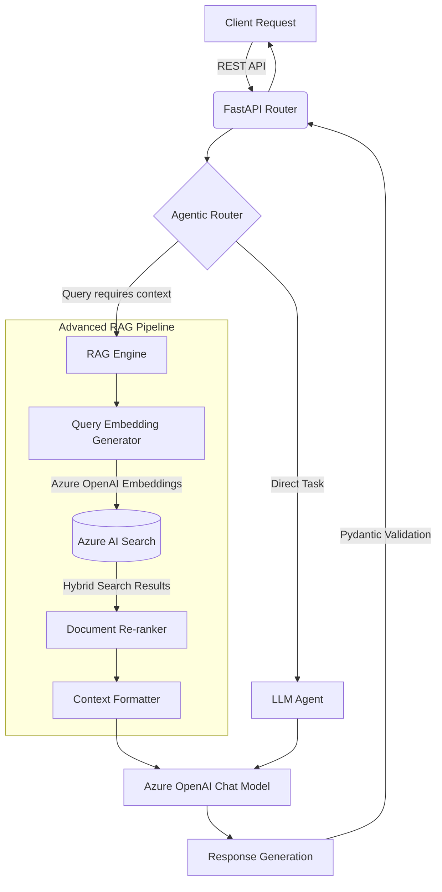

# Enterprise GenAI Azure Orchestrator

This repository contains a production-ready, enterprise-grade architecture for Generative AI applications leveraging Azure OpenAI, Azure AI Search, and LangChain orchestration.

## Architecture Overview

The system is designed with a layered architecture prioritizing modularity, scalability, and robust security. It features:
- **FastAPI Backend**: High-performance, asynchronous RESTful API for client interaction.
- **Agentic Workflows**: Multi-step reasoning agents implemented with LangChain, capable of autonomous tool-calling.
- **Advanced RAG Engine**: Hybrid search capabilities (keyword + semantic) using Azure AI Search and Azure OpenAI embeddings.
- **Infrastructure as Code (IaC)**: Automated deployment of Azure resources via Bicep templates.

### Retrieval-Augmented Generation (RAG) Pipeline

The RAG pipeline implements an advanced hybrid search strategy, retrieving the most relevant context before generating a response with the Azure OpenAI LLM.

## Setup & Deployment

1. **Environment Configuration**: Configure the `.env` file based on the `deployment/azure-deploy.bicep` outputs.
2. **Infrastructure**: Deploy the Bicep template to provision the necessary Azure resources (Azure OpenAI, Azure AI Search).
3. **Run API**: `uvicorn api.fastapi_app:app --host 0.0.0.0 --port 8000 --reload`
4. **Testing**: Run the comprehensive pytest suite via `pytest tests/`.

## Directory Structure
- `src/`: Core logic and agent implementations.
  - `core/`: RAG engine and core configurations.
  - `agents/`: LangChain agent definitions and workflows.
- `api/`: FastAPI application, routers, and Pydantic schemas.
- `deployment/`: Bicep templates for IaC.
- `tests/`: Unit and integration tests.
